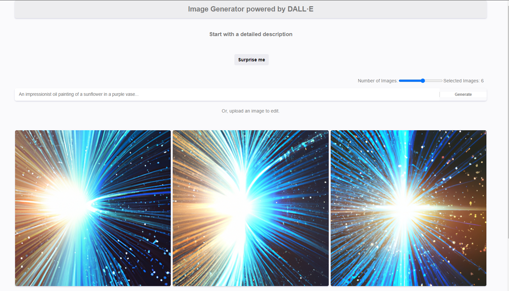
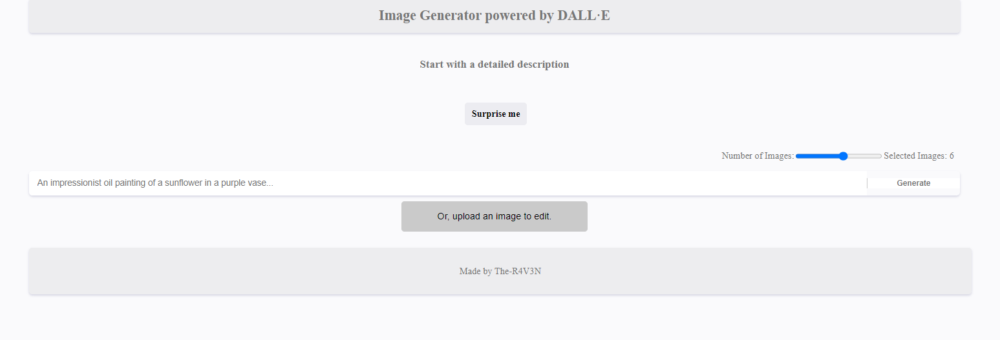
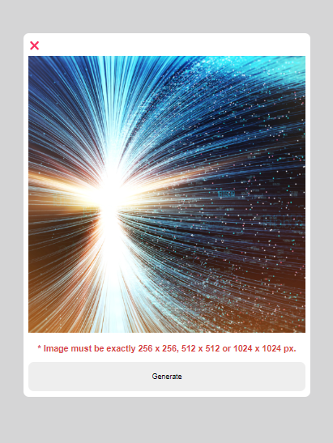

# 
Hey 👋, I'm The-R4V3N!
  

----

## 
 Connect with me  

 <a href="https://github.com/The-R4V3N" target="_blank">

</a>  

  
## Welcome! Glad to see you here  

## react-dall.e-clone

  
  

This repository contains a DALL·E clone made in React
  
## Table of Contents

- [Features](#features)
- [Getting Started](#getting-started)
- [Usage](#usage)
- [Contributing](#contributing)
- [License](#license)
- [Future of the project](#future)
  
## Features

You have the option to generate 1 to 10 images or allow the application to provide surprising results. Additionally, you can upload your own image and utilize the app to create up to 10 diverse variations based on it.

This images shows how it looks when images are generated.

This shows how the site looks when no images are generated.

This shows how the modal looks when you upload an image.

## Getting Started

  - Clone this repository to your local machine.
  - Set up your development environment and ensure you have the necessary dependencies installed.
  - You can install the necessary dependencies with:

  - Install Node.js from the [official Website](https://nodejs.org) if you dont have it already
  
### In the project  directory run

 `npm install` to install the necessary dependencies

  - Get your Api Key from [openai](https://openai.com/api/)
  - Create an account or login to openai, and then click on your profile and the API tab. Once there, you can generate a new API key.
  
  - Rename .env.example to .env and place your API-Key inside save it. 

  Now you are ready to use it
  
## Usage

In the project directory, you can run:

`npm run start:frontend` to start the frontend

Runs the app in the development mode.\
Open [http://localhost:3000](http://localhost:3000) to view it in your browser.

The page will reload when you make changes.\
You may also see any lint errors in the console.

`npm run start:backend` to start the server

Runs the server in the development mode.\
Open [http://localhost:8000](http://localhost:8000) to view it in your browser.

The server will reload when you make changes.\

### `npm test`

Launches the test runner in the interactive watch mode.\
See the section about [running tests](https://facebook.github.io/create-react-app/docs/running-tests) for more information.

### `npm run build`

Builds the app for production to the `build` folder.\
It correctly bundles React in production mode and optimizes the build for the best performance.

The build is minified and the filenames include the hashes.\
Your app is ready to be deployed!

See the section about [deployment](https://facebook.github.io/create-react-app/docs/deployment) for more information.

### `npm run eject`

**Note: this is a one-way operation. Once you `eject`, you can't go back!**

If you aren't satisfied with the build tool and configuration choices, you can `eject` at any time. This command will remove the single build dependency from your project.

Instead, it will copy all the configuration files and the transitive dependencies (webpack, Babel, ESLint, etc) right into your project so you have full control over them. All of the commands except `eject` will still work, but they will point to the copied scripts so you can tweak them. At this point you're on your own.

You don't have to ever use `eject`. The curated feature set is suitable for small and middle deployments, and you shouldn't feel obligated to use this feature. However we understand that this tool wouldn't be useful if you couldn't customize it when you are ready for it.

## Contributing

Contributions are welcome! If you have any ideas, suggestions, or improvements, please open an issue or submit a pull request.

## License

This project is licensed under the MIT License. Feel free to use and modify the code according to the terms of the license.

## Future

 In the forthcoming era, this clone will embody enhanced proficiencies in image editing, thereby augmenting its professional functionality to new heights. Furthermore, the incorporation of a dark theme might be considered to provide a visually sophisticated experience.
  
- 👨‍💻 All about me is at [My Website](https://www.oliver-joisten.se/)

&emsp;
<a href="https://paypal.me/paypal.me/TheR4V3N" target="_blank" style="display: inline-block;">

